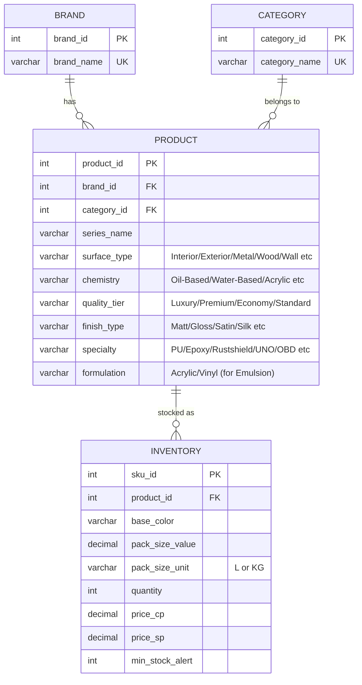

# 🎨 Paint Store Database — Research & Schema Brainstorm

## 1. Independent Research Summary

Below is a consolidated summary from my web research across multiple Indian paint industry sources (Asian Paints, Berger, Nerolac, IndiaMART, JustDial, etc.), organized per category.

---

### Emulsion

| Dimension | Values Found |
|---|---|
| **Surface** | Interior, Exterior |
| **Formulation** | Acrylic (most common, water-based), Vinyl (also water-based, budget) |
| **Quality Tier** | Luxury (e.g., Royale, Silk Glamor), Premium (e.g., Apcolite), Economy (e.g., Tractor, Walmasta) |
| **Finish** | Matt, Soft Sheen, Satin, Silk, Eggshell, Semi-Gloss, High Gloss, Textured |
| **Specialty** | Anti-fungal, Anti-algal, Low-VOC, Elastomeric (crack-bridging), Heat-reflective |
| **Base** | **All water-based** — confirmed across all sources |

### Enamel

| Dimension | Values Found |
|---|---|
| **Primary Surface** | Metal & Wood (doors, windows, grilles, furniture) |
| **Chemistry** | Oil-Based / Alkyd (dominant "Gold Standard"), Synthetic Enamel (high-gloss, chemically modified alkyd — overlaps heavily with oil-based), Water-Based / Acrylic Enamel (eco-friendly, low-odor, exists but niche) |
| **Specialty Variants** | PU (Polyurethane) — scratch/abrasion resistant, non-yellowing; Epoxy — two-part, industrial, waterproof; Rustshield — anti-corrosion |
| **Finish** | High Gloss (dominant), Satin, Matt |
| **Quality Tier** | Premium (e.g., Apcolite Premium, PU Advanced), Standard (e.g., Tractor Enamel) |

### Distemper

| Dimension | Values Found |
|---|---|
| **Type / Binder** | Dry Distemper (powder, chalky, cheapest), Oil-Bound Distemper / OBD (semi-washable, oil binders), Acrylic Distemper (modern, water-based, best shade range, washable) |
| **Sub-Variants** | UNO Acrylic Distemper (budget acrylic, e.g., Asian Paints Tractor UNO) |
| **Finish** | Matte (standard), Smooth Matte |
| **Surface** | Interior walls/ceilings only (except some exterior acrylic variants) |

### Primer

| Dimension | Values Found |
|---|---|
| **Surface Application** | Wall/Masonry (cement, plaster, brick), Wood (seals pores, prevents tannin bleed), Metal — Red Oxide (ferrous/iron anti-rust), Metal — Zinc Chromate (aluminum, light metals) |
| **Solvent Base** | Water-Based (fast-dry, low-VOC, best for interior masonry), Oil-Based (deeper penetration, best for wood and metal) |
| **Specialty** | Shellac-Based (extreme stain blocking — rare in typical Indian hardware stores), Epoxy Primer (industrial metals), Galvanized Metal Primer |
| **Quality Tier** | Standard, Premium |

---

## 2. Cross-Check: Your Research vs. My Research

### ✅ Agreements (Confirmed)

| Point | Verdict |
|---|---|
| **Emulsion: Interior/Exterior split** | ✅ Confirmed. Every source classifies emulsions this way. |
| **Emulsion: Acrylic vs Vinyl formulation** | ✅ Confirmed. Acrylic is the dominant modern standard; vinyl is the budget option. |
| **Emulsion: Luxury/Premium/Economy tiers** | ✅ Confirmed. Brands like Birla Opus and Indigo Paints explicitly use this tiering. |
| **Emulsion: Matt, Soft Sheen, Satin, Silk, etc.** | ✅ Confirmed. All sources list these finishes. |
| **Enamel: Metal & Wood as primary surfaces** | ✅ Confirmed. |
| **Enamel: Oil-Based (Alkyd) as the dominant type** | ✅ Confirmed. The "Gold Standard" designation is accurate. |
| **Enamel: PU and Epoxy as specialty variants** | ✅ Confirmed. Asian Paints has dedicated product lines (Apcolite Advanced PU, 2-Pack Epoxy). |
| **Enamel: High Gloss, Satin, Matt finishes** | ✅ Confirmed. |
| **Distemper: Acrylic Distemper (modern, washable)** | ✅ Confirmed. Tractor Acrylic Distemper is a market leader. |
| **Distemper: UNO as a value-added category** | ✅ Confirmed. Asian Paints Tractor UNO is a specific, well-known product line. |
| **Distemper: Matte / Smooth Matte finishes** | ✅ Confirmed. |
| **Primer: Wall/Wood/Metal surface split** | ✅ Confirmed. This is the universal primary categorization. |
| **Primer: Red Oxide / Zinc Chromate for metal** | ✅ Confirmed. Red Oxide is the dominant metal primer in India. |
| **Primer: Water-Based vs Oil-Based** | ✅ Confirmed. |

### 🔧 Corrections Applied (Per Your Remarks)

| Your Remark | Research Finding | Action |
|---|---|---|
| **No High-Temp Enamel** | My research *did* find "High-Temp" as a category (for engines/BBQs). However, this is an **industrial/niche** product not typically stocked in a hardware/paint retail shop. | ✅ **Removed** from scope. |
| **All Emulsions are water-based only** | ✅ Confirmed. All sources agree. Emulsions are by definition a water-based product. The Acrylic/Vinyl split is about the *binder resin*, not the solvent. | ✅ Schema will have no "base" column for emulsions. |
| **No Hard Distemper** | My research found "Oil-Bound Distemper (OBD)" instead of "Hard Distemper." The term "Hard Distemper" appears to be an older/textbook term. In the real Indian market, you find **Dry**, **Oil-Bound**, and **Acrylic**. | ✅ **Replaced** "Hard Distemper" with **"Oil-Bound Distemper (OBD)"**. |
| **No "Synthetic Distemper" category** | My research showed that "Synthetic Distemper" exists on some e-commerce platforms but is **not a distinct mainstream category** in the Indian hardware market. It overlaps heavily with Acrylic. | ✅ **Removed** as a separate type. |
| **Water-based enamels are very less sold** | ✅ Confirmed. Water-based enamel exists but is a **niche** product. Oil-based/Alkyd/Synthetic dominate massively. | ✅ Will keep it in the schema as a `chemistry` value but flag it as low-volume. |

### 🆕 Additional Findings (Not in Your Research)

| Finding | Details | Recommendation |
|---|---|---|
| **Enamel: "Synthetic Enamel" ≈ "Oil-Based Alkyd"** | In the Indian market, "Synthetic Enamel" is essentially a marketing label for chemically modified alkyd enamel. They are *not* fundamentally different types. | Combine into one chemistry: **"Synthetic/Alkyd (Oil-Based)"** |
| **Enamel: Rustshield as a specialty** | Asian Paints has a specific "Rustshield PU Enamel" product line for anti-corrosion. | Consider adding **"Rustshield"** as a specialty flag. |
| **Distemper: Dry Distemper** | The cheapest option, sold as **powder (in kg)**, not litres. This affects pack size units. | Schema needs **unit flexibility** (Litres vs Kg). |
| **Primer: Shellac-Based** | Exists but is rare in typical Indian hardware stores. Mostly imported/specialty. | **Exclude** from initial scope unless you stock it. |
| **Pack Sizes** | Enamel/Emulsion/Primer: 0.1L, 0.2L, 0.5L, 1L, 4L, 10L, 20L. Distemper: 2kg, 5kg, 10kg, 20kg (also some in litres). | Need a flexible `pack_size_unit` column. |

---

## 3. 📐 The Corrected Product DNA

After applying all corrections, here is the final "DNA" for each product family.

### Emulsion (Corrected)
```
Surface:      Interior | Exterior
Formulation:  Acrylic | Vinyl
Quality Tier: Luxury | Premium | Economy
Finish:       Matt | Soft Sheen | Satin | Silk | Eggshell | High Gloss | Textured
```

### Enamel (Corrected)
```
Chemistry:    Synthetic/Alkyd (Oil-Based) | Water-Based (Acrylic Enamel)
Specialty:    Standard | PU (Polyurethane) | Epoxy | Rustshield
Quality Tier: Premium | Standard
Finish:       High Gloss | Satin | Matt
```
> *Note: Water-Based is kept but flagged as low-volume.*

### Distemper (Corrected)
```
Type:         Dry Distemper | Oil-Bound (OBD) | Acrylic
Sub-Variant:  Standard | UNO (Value-Added)
Finish:       Matte | Smooth Matte
```

### Primer (Corrected)
```
Surface:      Wall/Masonry | Wood | Metal (Red Oxide) | Metal (Zinc Chromate)
Base:         Water-Based | Oil-Based
```

---

## 4. 🧠 Schema Design — Questions for Brainstorming

Before I build the schema, here are the key design decisions I want to discuss with you:

### Q1: Should category-specific attributes live in separate tables or in one flexible table?

**Option A: Separate attribute tables per category** (e.g., `emulsion_attributes`, `enamel_attributes`)
- ✅ Each table has clean, strongly-typed columns specific to that category.
- ❌ Adding a new category requires a new table. Queries span multiple tables.

**Option B: One unified `product_attributes` table** with columns like `surface_type`, `chemistry`, `finish_type`, `quality_tier`, `specialty`
- ✅ Simpler queries, one table for all products. Easy to extend.
- ❌ Many columns will be `NULL` for categories that don't use them (e.g., `chemistry` for distemper).

**Option C: Hybrid — a `product` table with shared columns + an EAV-style `product_attributes` table** for category-specific fields.
- ✅ Maximum flexibility.
- ❌ EAV is harder to query and loses type safety.

> **My recommendation: Option B** — A single `products` table with nullable category-specific columns. For a hardware store inventory system, the product count is manageable and this keeps queries simple. Null columns are a minor trade-off for huge query simplicity gains.

### Q2: Should "Finish", "Quality Tier", "Surface", etc. be lookup tables or enums (stored as VARCHAR)?

**Option A: Lookup / Reference tables** (e.g., `finish_type` table with `finish_id` + `finish_name`)
- ✅ Enforces referential integrity. Clean normalization.
- ❌ Too many small tables. Joins on every query.

**Option B: VARCHAR with CHECK constraints** or application-level validation.
- ✅ Simpler schema, fewer joins.
- ❌ Less strict DB-level enforcement.

> **My recommendation: Option A for high-value dimensions** (brand, category) and **Option B for stable low-cardinality enums** (finish, quality tier, surface type). These values rarely change and adding a table for 3-5 values is over-engineering.

### Q3: Pack size units — how to handle Litres vs Kg?

Distemper (especially Dry Distemper) is sold in kg, while everything else is in litres.

**Proposal:** `pack_size_value DECIMAL` + `pack_size_unit ENUM('L', 'KG')` in the `inventory` table.

### Q4: Do you want to track color/shade at the inventory level?

Currently `base_color` exists. But in practice, paints have:
- A **base** (e.g., P0, P1, N2, White Base) — this is what is physically stocked.
- A **shade** (e.g., "Coral Blush", "Royal Blue") — this is created by tinting a base at the counter.

**Do you want to track only the base, or also the shade?** For inventory, tracking the *base* is what matters (since that's what's physically on the shelf). Shades are "virtual" and made on demand.

### Q5: Do you stock all four categories, and do you plan to add more (e.g., Putty, Wood Polish, Thinner, Cement Paint)?

This affects whether we hard-code the four categories or make the schema easily extensible for future product types.

---

## 5. 📊 Proposed High-Level Schema (Draft for Discussion)



> [!IMPORTANT]
> This is a **draft** for discussion. The final schema depends on your answers to the questions above. Let's brainstorm before we commit to code!
